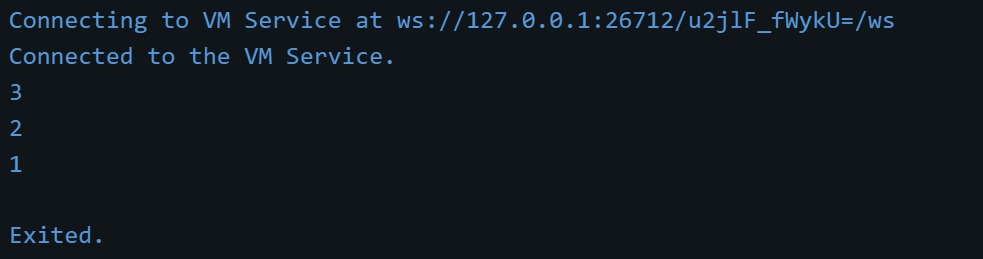
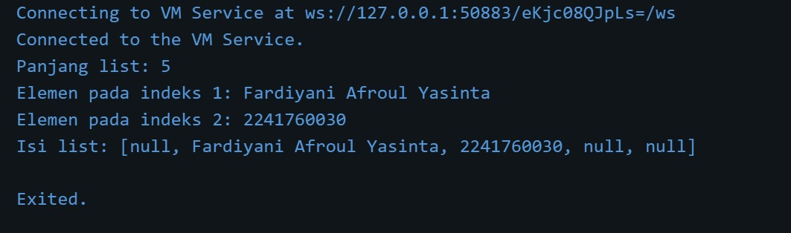
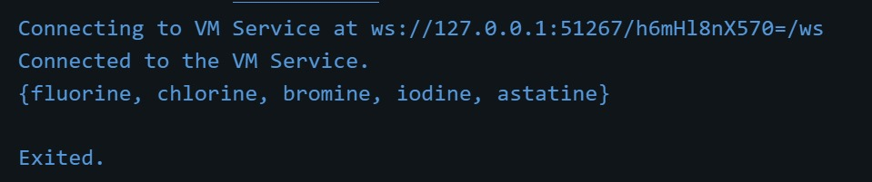
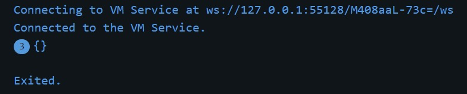

<h1>Laporan Praktikum Jobsheet 4 Pemograman Mobile</h1>

Nama  : Fardiyani Afro'ul Yasinta  
Kelas : SIB 3D  
NIM   : 2241760030

-----------------------------------------------
<b>-- Praktikum 1: Eksperimen Tipe Data List -- </b>
Langkah 1  
Ketik atau salin kode program berikut ke dalam void main().

Langkah 2  
Silakan coba eksekusi (Run) kode pada langkah 1 tersebut. Apa yang terjadi? Jelaskan!

Penjelasan:
Kode tersebut membuat sebuah list dengan tiga elemen `[1, 2, 3]`. Pertama, panjang list dicek dengan `assert` untuk memastikan panjangnya 3, yang benar. Kemudian elemen pada indeks 1 (nilai 2) dicek dengan `assert` untuk memastikan bahwa elemen tersebut memiliki nilai 2. Selanjutnya, panjang list (3) dan elemen pada indeks 1 (nilai 2) dicetak. Setelah itu, elemen pada indeks 1 diubah menjadi 1, dan dilakukan `assert` lagi untuk memastikan bahwa elemen tersebut sekarang bernilai 1. Terakhir, elemen yang telah diubah tersebut dicetak dengan nilai baru 1.

Langkah 3  
Ubah kode pada langkah 1 menjadi variabel final yang mempunyai index = 5 dengan default value = null. Isilah nama dan NIM Anda pada elemen index ke-1 dan ke-2. Lalu print dan capture hasilnya.

Apa yang terjadi ? Jika terjadi error, silakan perbaiki.

Penjelasan:
Kode tersebut membuat sebuah list berukuran 5 yang diinisialisasi dengan nilai `null` pada semua elemennya menggunakan `List.filled(5, null)`. Kemudian, elemen pada indeks 1 diisi dengan string `'Fardiyani Afroul Yasinta'`, dan elemen pada indeks 2 diisi dengan string `'2241760030'` (NIM). Setelah itu, panjang list yang berisi 5 elemen dicetak, diikuti dengan mencetak elemen pada indeks 1 dan 2 yang telah diisi. Terakhir, seluruh isi list dicetak, di mana hasilnya menunjukkan bahwa elemen pada indeks 1 dan 2 berisi nilai yang telah diberikan, sementara elemen lainnya tetap `null`. Output dari kode ini menampilkan panjang list (5), elemen pada indeks 1 (`Fardiyani Afroul Yasinta`), indeks 2 (`2241760030`), dan list lengkap dengan nilai `null` pada elemen selain indeks 1 dan 2.

<b>-- Praktikum 2: Eksperimen Tipe Data Set -- </b> 
Langkah 1 
Ketik atau salin kode program berikut ke dalam fungsi main().

Langkah 2  
Silakan coba eksekusi (Run) kode pada langkah 1 tersebut. Apa yang terjadi? Jelaskan! Lalu perbaiki jika terjadi error.

penjelasan:

Langkah 3  
Tambahkan kode program berikut, lalu coba eksekusi (Run) kode Anda.

Apa yang terjadi ? Jika terjadi error, silakan perbaiki namun tetap menggunakan ketiga variabel tersebut. Tambahkan elemen nama dan NIM Anda pada kedua variabel Set tersebut dengan dua fungsi berbeda yaitu .add() dan .addAll(). Untuk variabel Map dihapus, nanti kita coba di praktikum selanjutnya

penjelasan:
Kode di atas tidak menghasilkan error. Namun, output dari ketiga variabel (names1, names2, dan names3) terlihat sama, yakni {}, tipe data di baliknya berbeda.

<b>-- Praktikum 3: Eksperimen Tipe Data Maps --  </b>
Langkah 1 
Ketik atau salin kode program berikut ke dalam fungsi main()

Langkah 2  
Silakan coba eksekusi (Run) kode pada langkah 1 tersebut. Apa yang terjadi? Jelaskan! Lalu perbaiki jika terjadi error.

Langkah 3  
Tambahkan kode program berikut, lalu coba eksekusi (Run) kode Anda.
Apa yang terjadi ? Jika terjadi error, silakan perbaiki.
Jawab:
Kode di atas akan menghasilkan error saat dijalankan karena variabel gifts dan nobleGases belum dideklarasikan. Variabel gifts dan nobleGases seharusnya didefinisikan sebagai Map sebelum nilai-nilai ditambahkan ke dalamnya.

Tambahkan elemen nama dan NIM Anda pada tiap variabel di atas (gifts, nobleGases, mhs1, dan mhs2). Dokumentasikan hasilnya dan buat laporannya!

<b>-- Praktikum 4: Eksperimen Tipe Data List: Spread dan Control-flow Operators -- </b> 
Langkah 1  
Ketik atau salin kode program berikut ke dalam fungsi main().

Langkah 2  
Silakan coba eksekusi (Run) kode pada langkah 1 tersebut. Apa yang terjadi? Jelaskan! Lalu perbaiki jika terjadi error. 
<b>Jawab:</b>
Kode di atas akan mengalami error saat dijalankan. Karena penggunaan variabel list1 yang tidak dideklarasikan sebelumnya. Variabel yang seharusnya digunakan adalah list, bukan list1.

Langkah 3  
Tambahkan kode program berikut, lalu coba eksekusi (Run) kode Anda.
Apa yang terjadi ? Jika terjadi error, silakan perbaiki.

Tambahkan variabel list berisi NIM Anda menggunakan Spread Operators. Dokumentasikan hasilnya dan buat laporannya!

Langkah 4  
Tambahkan kode program berikut, lalu coba eksekusi (Run) kode Anda.
Apa yang terjadi ? Jika terjadi error, silakan perbaiki. Tunjukkan hasilnya jika variabel promoActive ketika true dan false. 
<b>Jawab:</b>
Ya, kode di atas akan mengalami error jika dijalankan tanpa mendefinisikan variabel promoActive terlebih dahulu. Variabel promoActive harus dideklarasikan sebagai sebuah boolean sebelum digunakan dalam list comprehension.

Langkah 5  
Tambahkan kode program berikut, lalu coba eksekusi (Run) kode Anda. 
<b>Jawab:</b>
Ya, kode di atas akan mengalami error jika dijalankan tanpa mendefinisikan variabel login terlebih dahulu. Variabel login harus dideklarasikan sebelum digunakan dalam list comprehension.

Apa yang terjadi ? Jika terjadi error, silakan perbaiki. Tunjukkan hasilnya jika variabel login mempunyai kondisi lain.

Langkah 6  
Tambahkan kode program berikut, lalu coba eksekusi (Run) kode Anda.
Apa yang terjadi ? Jika terjadi error, silakan perbaiki. Jelaskan manfaat Collection For dan dokumentasikan hasilnya.

<b>-- Praktikum 5: Eksperimen Tipe Data Records --</b>  

Langkah 1  
Ketik atau salin kode program berikut ke dalam fungsi main()

Langkah 2  
Silakan coba eksekusi (Run) kode pada langkah 1 tersebut. Apa yang terjadi? Jelaskan! Lalu perbaiki jika terjadi error.  
<b>Jawab:</b>
jika menggunakan Dart 3.0 atau lebih baru, kode tersebut akan berfungsi dengan baik tanpa error dan akan mencetak output yang menunjukkan nilai-nilai dari tuple atau record yang didefinisikan.

Langkah 3   
Tambahkan kode program berikut di luar scope void main(), lalu coba eksekusi (Run) kode Anda.

Langkah 4  
Tambahkan kode program berikut di dalam scope void main(), lalu coba eksekusi (Run) kode Anda.

Langkah 5  
Tambahkan kode program berikut di dalam scope void main(), lalu coba eksekusi (Run) kode Anda. 
Apa yang terjadi ? Jika terjadi error, silakan perbaiki. Gantilah salah satu isi record dengan nama dan NIM Anda, lalu dokumentasikan hasilnya dan buat laporannya!

<b>-- Tugas Praktikum --</b> 
1. Silakan selesaikan Praktikum 1 sampai 5, lalu dokumentasikan berupa screenshot hasil pekerjaan Anda beserta penjelasannya!
2. Jelaskan yang dimaksud Functions dalam bahasa Dart!
3. Jelaskan jenis-jenis parameter di Functions beserta contoh sintaksnya!
4. Jelaskan maksud Functions sebagai first-class objects beserta contoh sintaknya!
5. Apa itu Anonymous Functions? Jelaskan dan berikan contohnya!
6. Jelaskan perbedaan Lexical scope dan Lexical closures! Berikan contohnya!
7. Jelaskan dengan contoh cara membuat return multiple value di Functions!
8. Kumpulkan berupa link commit repo GitHub pada tautan yang telah disediakan di grup Telegram!
