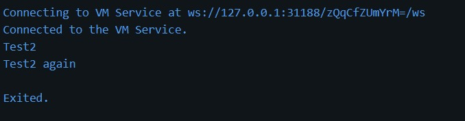
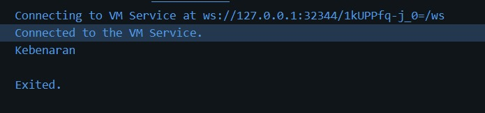
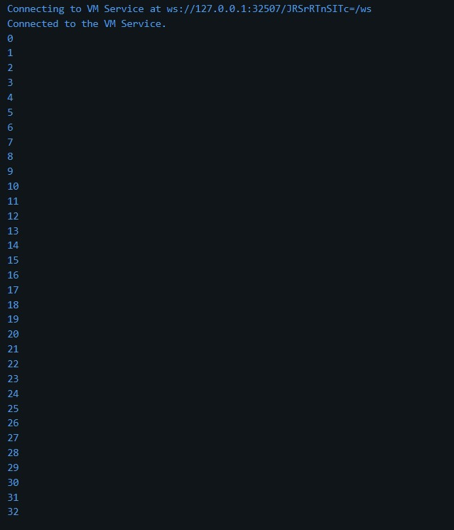
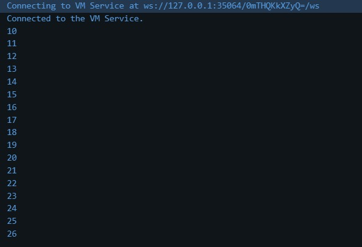
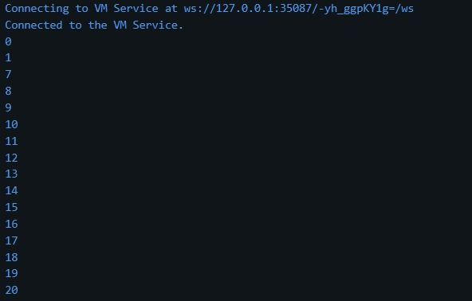
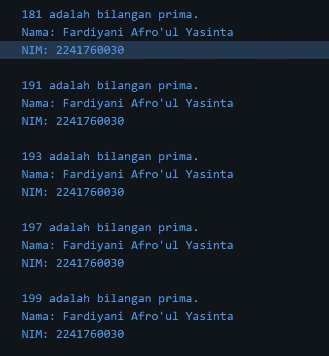
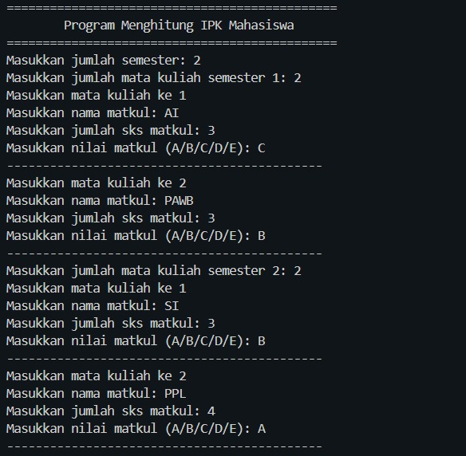
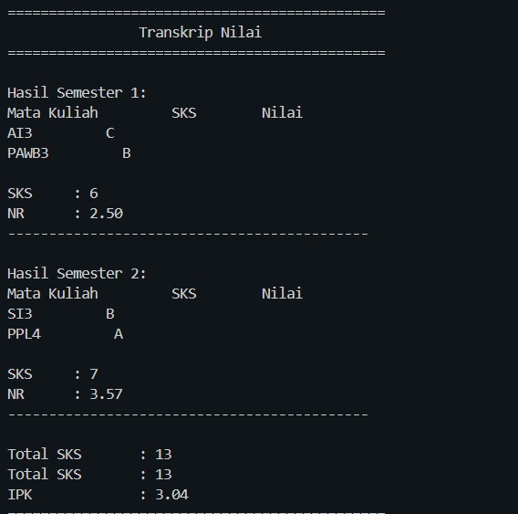

<h3>Laporan Praktikum Jobsheet 3 Pemograman Mobile</h3>

Nama  : Fardiyani Afro'ul Yasinta  
Kelas : SIB 3D  
NIM   : 2241760030

-- Praktikum 1

kode mengalami error dan melakukan perubahan pada "Else" yang seharusnya ditulis huruf kecil "else", karena bahasa dart bahasa yang case sensitive. Setelah diperbaiki maka kode tersebut saat dijalankan menampilkan test2 dan test2 again karena variabel test diinisialisasi dengan nilai test2, pada kondisi if pertama tidak terpenuhi karena test sama dengan test1, kemudian pada kondisi else if terpenuhi test sama dengan test 2 maka akan dicetak, setelah itu memeriksa kondisi else, jika sebelumnya tidak terpenuhi maka akan dicetak, kemudian if statement yang kedua terpenuhi karena test == test2 maka akan dicetak test2 again.  

kode mengalami error dan diperbaiki dengan menambahkan kondisi if test == "true", maka output yang dihasilkan adalah kebenaran karena test yang di inisialisasi "true" sehingga saat dilakukan pengecekan pada kondisi test terpenuhi.    

-- Praktikum 2

kode mengalami error dan di perbaiki dengan melakukan inisialisasi counter = 0, maka outputnya menampilkan angka 0 hingga angka 32.  

sama dengan sebelumnya kode diatas membutuhkan inisialisasi counter = 0 dan output menampilkan angka 0 hingga angka 76.    

-- Praktikum 3

kode mengalami error dan perlu perbaikan dengan menambahkan tipe data int serta memperbaiki penulisan index dan menambahkan increment, sehingga menampilkan angka 10 hingga 26.  

kode mengalami error dan perlu perbaikan dengan memberikan looping for serta mengganti operator yg sebelumnya || menjadi &&, outputnya menampilkan angka 0,1 dan mengalami break, kemudian di lanjutkan ke angka 7 hingga 20.    

-- Tugas Praktikum  
Soal no 2

kode diatas menampilkan bilangan prima angka 0 sampai 201 dan setiap menampilkan bilangan prima akan tampil nama lengkap Fardiyani Afro'ul Yasinta dan NIM 2241760030.

dart-calculator

kode diatas merupakan kalkulator perhitungan IPK Mahasiswa yang menampilkan mata kuliah setiap semester serta menampilkan hasil IP/NR dan IPK.

